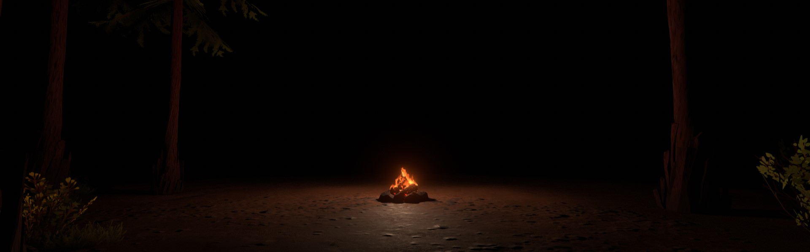

<h1 align="center">Hi 👋, I'm Mario Muñoz</h1>


[](https://www.linkedin.com/in/mario-muñoz-pequeño/)

###  Un poco sobre mi...  

```javascript
const Mario = {
  estudios: ["Desarrollo de aplicaciones multiplataforma", "Automatización y robótica industrial", "Telecomunicaciones"],
  lenguajes: [Java, C#,Kotlin, HTML, CSS, SQL],
  herramientas: [Git, VSCode, Android Studio, Unity],
  desafío: "Quiero hacer grandes aportaciones al mundo de la informática"
}
```


<h3 align="center">Languages and Tools</h3>

[](https://skillicons.dev)
