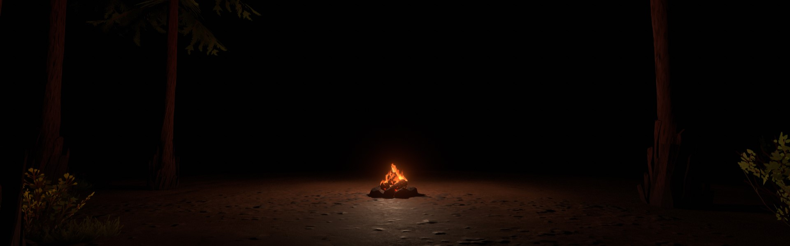

<h1 align="center">Hi 👋, I'm Mario Muñoz</h1>



Software developer from Spain 🇪🇸

Interested in Artificial Intelligence, backend development, automation and game development.

Currently building personal projects while continuing to learn new technologies.


[](https://www.linkedin.com/in/mario-muñoz-pequeño/)

###  Few things about me...  

```javascript
const Mario = {
  studies: ["Multiplatform application development", "Industrial automation and robotics", "Telecommunications"],
  languages: ["Java", "C#", "Kotlin", "HTML", "CSS", "SQL"],
  tools: ["Git", "VSCode", "Android Studio", "Unity"],
  challenge: "I want to make significant contributions to the world of computer science"
}
```


<h3 align="center">Languages and Tools</h3>

[](https://skillicons.dev)
