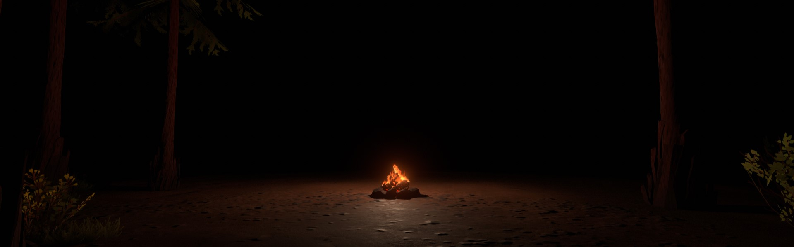

<h1 align="center">Mario Muñoz</h1>

Desarrollador de software

---

Construyo proyectos personales porque me gusta entender cómo funcionan las cosas.

Me interesan especialmente el desarrollo backend, las aplicaciones web, la automatización y el procesamiento de datos. Disfruto diseñando proyectos que puedan crecer con el tiempo, cuidando tanto la arquitectura como los pequeños detalles de la implementación.

Actualmente dedico mi tiempo libre a desarrollar herramientas y aplicaciones que me permiten aprender tecnologías nuevas mientras intento resolver problemas reales.

## Proyectos

### Dungeon Archive

Aplicación web para consultar contenido de D&D 5e de forma rápida y completamente offline.

Actualmente incluye un pipeline de importación, transformación e indexación de miles de entidades procedentes de diferentes fuentes, priorizando el rendimiento y la facilidad de búsqueda.

**Tecnologías**

- React
- TypeScript
- IndexedDB
- Vite

---

### Cosmere Archive

Biblioteca interactiva inspirada en el universo de Brandon Sanderson.

El objetivo no es construir una wiki, sino una experiencia visual con mapas, estanterías, árboles genealógicos y modelos 3D que transmitan la sensación de explorar un archivo real.

**Tecnologías**

- React
- TypeScript
- React Three Fiber
- Framer Motion

---

## Tecnologías

TypeScript · React · Java · Python · SQL · Git

He trabajado también con Kotlin, C#, Android y Unity, aunque actualmente la mayoría de mis proyectos personales están orientados al desarrollo web.

---

## Contacto

- LinkedIn: https://www.linkedin.com/in/mario-muñoz-pequeño/
